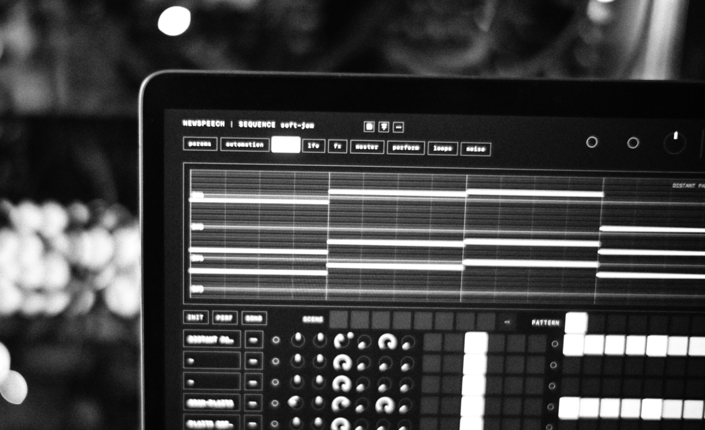

I think it's probably pretty common for creative types to run into walls when it comes to finishing up ideas etc etc - based on the amount of toxic AF synthtube videos talking about it at least. I definitely have this same tendency which I think stems from seeing all of this equipment and hardware and gear as opportunities vs. as specific tools. I've never been the person who needs a specific caliber of gear or anything. sure, a well crafted instrument is more fun to play, but i've always been able to find sounds I like in basically every piece of equipment I've ever used - this is awesome, but also ends up with a lot of individual sounds and ideas but nothing concrete. 

my fascination with synths on top of my prior guitar stuff definitely stemmed from the promise of being able to "be my own band" or whatever but ive never actually managed to pull it off outside of a logic session or two. The ideas are all there, but the technical hurdles of hardware sequencers or ableton automations or whatever else have always stopped this from really growing past a few demos. 

## enter AI - the part where most people stop reading

i work in design, marketing software development and have for about 20 years at this point. This means nothing other than perhaps having a bit more background in this type of technology than some others and while a lot of the hype around AI and music, especially things like Suno and "generative" music tooling, is pretty overblown or just awful. (seriously, fuck the concept of suno). I've come to the conclusion that AI as a tool to build tools is incredibly powerful and inspiring.  I don't want claude to write songs for me, but I do want tooling customized to my exact workflows to help me go from ideas to output with less monotonous friction - I still want friction, but not the boring technical kind. 

> just to be clear, fuck suno
> fuck generative AI
> build tools, make art with them

## build my own tools

the start of this was a web based sequencer that I thought would be a fun little UI project and toy, but as I got further and further into iterating on these ideas I started to realize that there was a lot more capability here than I expected. The fun toy project turned into "can I make my own instrument?". Sometime at the start of May I realized that the midi capabilities that this tech provides would allow me to quickly replace my current hardware drum sequencer - that was built about a day later, and the sequencer went off to reverb. I've also been a fan of harmony driven sequencers so the next step was - ok, let's add harmony to this. Again, about a day later and that sequencer is listed on reverb. 

At this point this was feeling more like the cornerstone of a project than an little extra tooling. This is where the actual application came into play. What if I could build my macbook into the center of the "electronic" elements of this new band. I don't want to be a "playback" band but I do want to incorporate hardware synth elements without abandoning playing guitar and I unfortunately lack the extra appendages to play both at once. 

## who the app is for

Me. I built this for me, that's the end of the story. There's no dreams of monetization, mass distribution or anything. I think it's cool and will release it at some point to other like-minded folks, but I don't want to kill the joy from this. There's a certain romantic idea of just creating something specifically for myself without outside opinion and then releasing it without the intent to cater to anyone else's needs or ideas. 

[check it out for yourself here](../texture.html)

---

