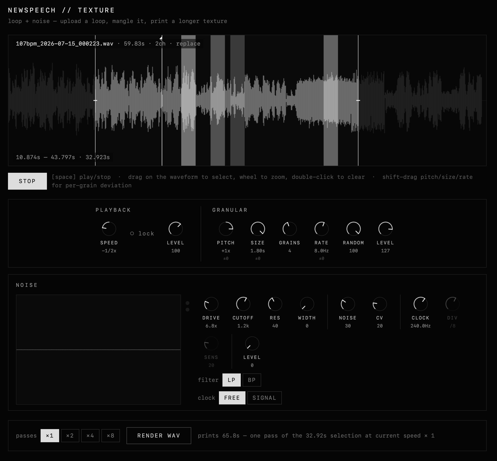

during the development of the sequence app i kept coming back to the idea of this kind of granular processing layer allowing you to create loops, process them in real time and then kick them out into the mix of the app. this exists and works great within the application itself but after using the sequence app during a recording session last week i realized that the textural assets that i was creating were being used in the DAW more than i had expected, being able to quickly take a sound and then mangle it and kick it back out as a granular soundscape was intriguing so TEXTURE was born.

this initial build allows me (and you!) to manipulate these files from the browser vs. needing to have the app running for the wav export feature etc etc. this is admittedly a niche product, but rather than spend $650 on a desktop hardware granular processor we can just mangle files in the browser now.

the core functionality here is a varispeed tape player that allows you to reverse and adjust the playback on the initial loop, this also features a lock that will slow the playback but lock the pitch of the source material - this gets into the paulstretch territory allowing you to slow down a file by 16x. this obviously introduces a fuckton of artifacting and weird aliases, which is fully the point. 

on top of that the granular engine allows you to toss some grains on top, the random control adjusts where the grains are pulled from (100% random is the full sample) this allows speed changes as well, but is locked to octaves to maintain some level of coherence within a mix. 

the noise section at the bottom is a filter with a noise source added into it - this creates all kinds of unruly clicking and artifacts. use at your own risk

[check it out for yourself here](../texture.html)

---

