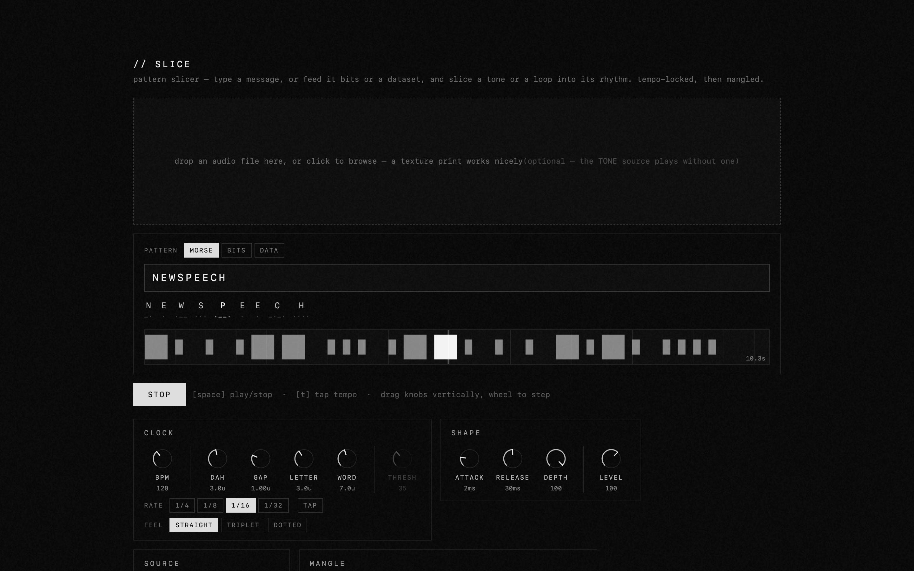
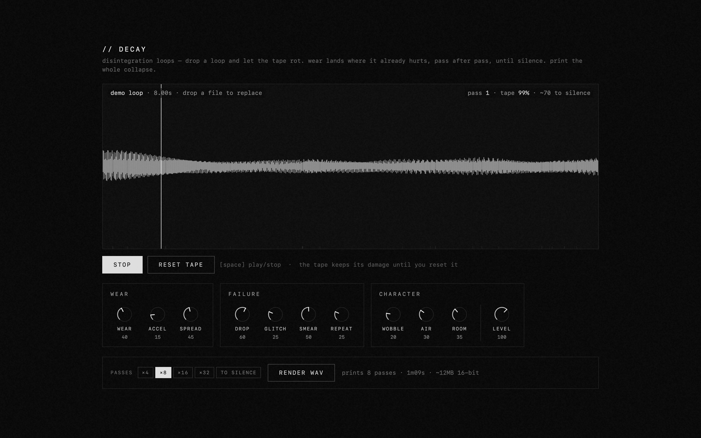
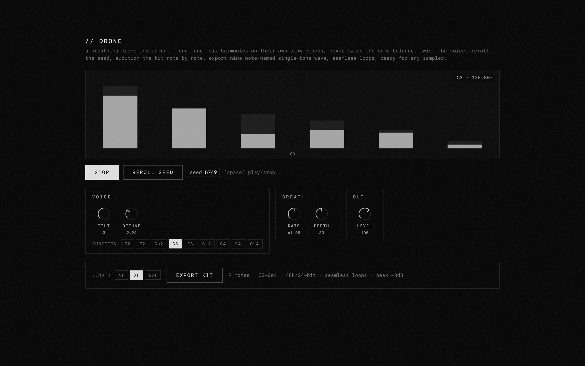

I spent a tumultuous few days in New Orleans for this year's Cutting Edge Conference - I was asked to speak on a panel about music technology and used it basically just to tell people to cancel their spotify accounts, crack a few dream theater jokes and talk about how *all* AI tools aren't terrible. If any of you have toured or done production work you realize that there's a lot of downtime to these types of events and schedules. This means a lot of headphone time while walking around the city, or time scrolling on your phone depending on how realistic and romantic of a picture you want to paint. 

Coming out of this time I had a few ideas for new tooling for future newspeech releases (first ep is being mixed by PJ Solo right now!) they all came together from the same idea that kind of is the undercurrent of this whole project, things falling apart. 

## slice

I've always been fascinated with rhythm as a method to convey a message and in this case it seemed the right time to do that literally. This tool lets you take any audio source and parse it through a morse code, binary or any data set filter resulting in interesting and strange patterns that most people probably wouldn't have tapped out on their knee. I think the novelty here for me is the idea of burying meaning within instrumental music, furthering the idea and concepts I posted about previously for the hurricane dataset concept within sequence.

this tool is incredibly simple to use and I think sees the most interesting results with a drone bed, allowing the tool to provide the movement. 

[try slice](../slice.html)

## decay

spending an hour or so walking from a hotel to the venue for the panel discussion at cutting edge it felt appropriate to listen to William Basinski's Disintegration Loops record. I come back to this album often but walking out of the CBD of New Orleans into the neighborhoods seemed the right backdrop. Which got me thinking - what if this was a digital option?

decay follows the disintegration concept, it's an inherently slow machine, feed it a short loop and watch it fall apart, eventually to silence. there's something therapeutic to me with this type of intentionally slow process. Would it be possible to just build this to export the 70% decayed loop from the start? Definitely, but i'm not going to do that. 

[try decay](../decay.html)

## drone

in order to test and seed the decay engine (on a flight from ATL to ONT) i needed a quick pad of drone harmonics. this was initially just a test bed, but the output was interesting enough to warrant its own tool, purpose made to export a drone set of samples ready to load into sequence.

you can test this in browser, manually tweak the mix and then export at a few lengths, it's a simple drone voice but paired with some of the other tooling also available here it can produce an interesting and compelling soundscape. works great as a baseline within a sequence project

[try drone](../drone.html)

## browser based tooling

these tools living in the browser instead of just within a plugin or workflow on my machine is an interesting new concept for me and continues to be intriguing. If nothing else to practice what i preach and just build out the tooling that i want to use to make music. this website will never be high traffic, but i find myself using it more and more within my own work
